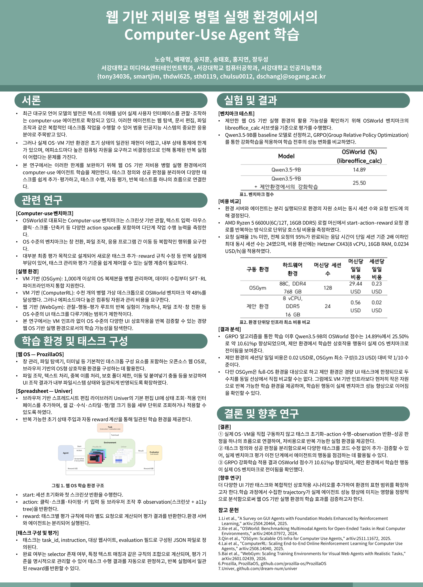
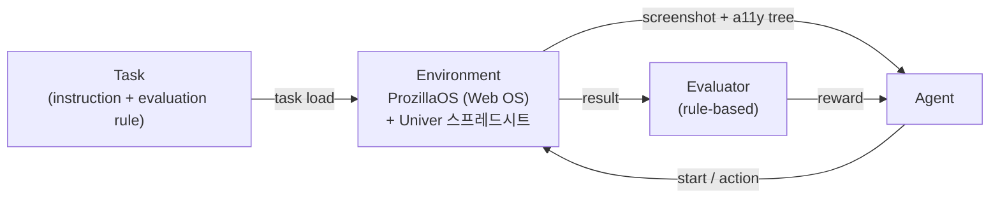

<div align="center">

# WebOS-Gym

### 웹 OS 기반 저비용 병렬 실행 환경에서의 Computer-Use Agent 학습

**Training Computer-Use Agents in a Low-Cost Parallel Execution Environment Based on Web OS**

[](./paper/논문%20최종본.pdf)
[](https://github.com/prozilla-os/ProzillaOS)
[](https://github.com/dream-num/univer)
[](./LICENSE)



</div>

---

## 한눈에 보기

**WebOS-Gym**은 computer-use agent를 **저비용으로 반복 학습·평가**할 수 있는 **웹 OS 기반 병렬 실행 환경**입니다.
실제 OS나 VM을 직접 구동하지 않고, 웹 브라우저에서 동작하는 [ProzillaOS](https://github.com/prozilla-os/ProzillaOS)와
스프레드시트 라이브러리 [Univer](https://github.com/dream-num/univer) 위에
**task 정의 ↔ 성공 판정(평가)을 분리**한 구조를 올려, 코드 수정 없이 데이터 수준에서 task를 추가·검증할 수 있습니다.

> 본 저장소는 KCC 2026 논문 *"웹 OS 기반 저비용 병렬 실행 환경에서의 Computer-Use Agent 학습"* 의 구현 및 task 모음입니다.

---

## 목차

- [배경 및 동기](#배경-및-동기)
- [핵심 특징](#핵심-특징)
- [시스템 구조](#시스템-구조)
- [Task 구조](#task-구조)
- [실험 결과](#실험-결과)
- [논문 & 포스터](#논문--포스터)
- [저자 및 사사](#저자-및-사사)
- [라이선스](#라이선스)

---

## 배경 및 동기

멀티모달 대규모 언어 모델의 발전으로, 스크린샷과 UI 구조 정보를 바탕으로 실제 사용자처럼 웹·데스크톱 환경을 조작하는
**computer-use agent** 연구가 활발해지고 있습니다. 그러나 기존 학습 환경에는 다음과 같은 한계가 있습니다.

- **VM / 실제 OS 기반 환경**(예: [OSGym](https://arxiv.org/abs/2511.11672), [ComputerRL](https://arxiv.org/abs/2508.14040))은
  task별 초기 상태 재현, 대규모 반복 실험, 내부 상태 점검에 **높은 비용과 복잡성**이 따릅니다.
- **경량 웹 기반 환경**(예: [WebGym](https://arxiv.org/abs/2510.02439))은 효율적이지만 **단일 웹페이지 탐색에 한정**되어,
  파일 조작·창 전환·앱 간 이동 같은 **OS 수준 UI task**를 다루기 어렵습니다.

WebOS-Gym은 무거운 VM 인프라 없이 **OS 수준의 다양한 UI 상호작용을 반복 검증**할 수 있는
경량 웹 OS 기반 실행 환경을 제안합니다.

---

## 핵심 특징

| 특징 | 설명 |
| --- | --- |
| **저비용 병렬 실행** | 환경 서버와 agent를 분리 실행하여, 세션당 일일 비용이 VM 기반 대비 **약 1/10** 수준 |
| **웹 OS 상호작용** | [ProzillaOS](https://github.com/prozilla-os/ProzillaOS) 기반으로 창 관리·파일 탐색기·터미널 등 OS 수준 task 지원 |
| **스프레드시트 통합** | [Univer](https://github.com/dream-num/univer) 편집 UI에 상태 조회 인터페이스를 추가, 셀 값·수식·스타일을 세부 단위로 평가 |
| **Task / 평가 분리** | task는 JSON으로 정의하고 성공 판정은 rule 기반으로 분리 → **코드 수정 없이** task 추가 |
| **결정론적 반복 실험** | 반복 가능한 초기 상태 주입과 자동 reward 계산으로 일관된 학습 환경 제공 |

---

## 시스템 구조

외부 agent는 환경과 **`start` / `action` / `observation`** 세 가지 요청으로 상호작용하며,
환경은 task별 평가 규칙에 따라 **reward**를 반환합니다.



| 요청 | 동작 |
| --- | --- |
| **`start`** | 세션 초기화 + 첫 스크린샷 반환 |
| **`action`** | 클릭 · 스크롤 · 타이핑 · 키 입력 실행 후 observation 반환 |
| **`observation`** | 스크린샷 + **a11y tree(accessibility tree)** 반환 |
| **`reward`** | task별 평가 규칙에 따라 계산되어 평가 결과 반환 |

---

## Task 구조

WebOS-Gym의 task는 **무엇을 시키는지(instruction)** 와 **성공을 어떻게 판정하는지(evaluation)** 를
하나의 JSON 안에 분리해 담습니다. 따라서 새로운 task를 만들 때 코드를 고칠 필요 없이 데이터만 추가하면 됩니다.

### 1) Rule-based task 스키마 (ProzillaOS UI)

| 필드 | 타입 | 설명 |
| --- | --- | --- |
| `task_id` | `string` | task 고유 식별자 |
| `instruction` | `string` | agent에게 주어지는 자연어 지시 |
| `website` | `string` | task가 수행되는 URL(웹 OS 진입점) |
| `evaluation.mode` | `"all"` \| `"any"` | 여러 규칙의 결합 방식(AND/OR) |
| `evaluation.rules[]` | `object[]` | 성공 판정 규칙 목록 |
| `rules[].selector` | `string` | 검사 대상 DOM 요소의 CSS selector |
| `rules[].text` | `string` | 기대하는 텍스트 값 |
| `rules[].match` | `"exact"` \| `"contains"` \| `"regex"` | 텍스트 매칭 방식 |

```json
{
  "task_id": "prozilla_task_001",
  "instruction": "Open Terminal and run `pwd`. Leave the output visible.",
  "website": "http://localhost:3000",
  "evaluation": {
    "mode": "all",
    "rules": [
      { "selector": "div[class*='Terminal']", "text": "/home/prozilla-os", "match": "contains" }
    ]
  }
}
```

> **이 task가 시키는 일**: 터미널을 열고 `pwd`를 실행해 현재 경로(`/home/prozilla-os`)가 화면에 보이게 한다.
> Terminal 영역의 텍스트에 해당 경로가 포함되어 있으면 성공으로 판정한다.

### 2) Spreadsheet task 스키마 (Univer cell-meta)

스프레드시트 task는 셀 단위 상태를 명시하는 **cell-meta 스키마**를 사용합니다.
`states`의 각 항목은 셀의 초기 상태/목표 상태를 정의하며, `applyf`로 상태를 주입하고 `evalf`로 검증합니다.

| 필드 | 설명 |
| --- | --- |
| `instruction` | agent에게 주어지는 자연어 지시 |
| `empty_start` | 빈 시트에서 시작할지 여부 |
| `states[]` | 셀 단위 상태 정의 목록 |
| `states[].evalf` / `applyf` | 상태 검증/주입 함수 (예: `getCellMeta` / `applyCellMeta`) |
| `states[].param` | 대상 셀 좌표 (예: `"A2"`) |
| `states[].property` | 조회할 속성 경로 (예: `["cell", "v"]` = 셀 값) |
| `states[].value` | 기대 값 |
| `states[].match` | 매칭 방식 (`exact` / `contains` / `regex`) |

```jsonc
{
  "instruction": "Make each column header bold for the given table",
  "empty_start": false,
  "states": [
    [
      { "evalf": "getCellMeta", "applyf": "applyCellMeta", "param": "A2",
        "property": ["cell", "v"], "value": "Year", "match": "exact" }
    ]
  ]
}
```

### Task 예시 모음

`task/seed/spreadsheet/seeds/`에 포함된 spreadsheet seed들이 다루는 작업 유형의 일부입니다 — 실제 사무 업무에 가까운 셀 조작·서식·계산·데이터 정리 task로 구성됩니다.

| Task | 수행 내용 |
| --- | --- |
| `bold_header` | 표의 각 열 머리글을 굵게(bold) 처리 |
| `sort_by_date` | Date 열 기준으로 표를 오름차순 정렬 |
| `calculate_profit_margin` | "Gross Profit / Sales"로 주차별 이익률 열을 새로 계산·추가 |
| `unique_departments` | 부서 목록에서 중복을 제거해 첫 등장 순서대로 고유 부서를 나열 |
| `format_phonenumber` | 전화번호를 `###-###-####` 형식으로 정규화 |
| `classify_bmi_status` | BMI 분류 기준표를 참조해 각 인원의 체중 상태를 채움 |

> 이 50종의 seed는 논문 spreadsheet task의 **원천(증강 전 기준 task)** 이며, 다양한 표 데이터에 대해 증강되어 학습/평가 task로 확장됩니다.

### 디렉토리 구성

| 경로 | 내용 |
| --- | --- |
| `task/seed/spreadsheet/seeds/` | 논문 spreadsheet task의 **원천 seed 50종**(증강 전 기준 task) — 현행 task 셋 |
| `task/` (그 외) | 개발 과정에서 수집된 도메인별 task 모음 — **레거시(legacy)**, 참고용으로만 보관 |
| `task/utils/` | JSON 포매터 · 평가 규칙 테스트 등 도구 |

> 현재 권장 task 셋은 `task/seed/spreadsheet/seeds/`의 seed 50종입니다.
> 실행/롤아웃 환경(SurfGym, gateway·rollout)은 별도 저장소에서 관리됩니다.

---

## 실험 결과

### OSWorld 벤치마크 (libreoffice_calc)

제안 환경에서 **GRPO(Group Relative Policy Optimization)** 강화학습을 적용한 뒤,
OSWorld의 `libreoffice_calc` 서브셋에서 성능을 측정했습니다.

| Model | OSWorld (%) — `libreoffice_calc` |
| --- | :---: |
| Qwen3.5-9B (baseline) | 14.89 |
| **Qwen3.5-9B + 제안환경 강화학습** | **25.50** |

> 제안 환경에서 학습한 상호작용 행동이 실제 OS 기반 벤치마크 성능 향상(**+10.61%p**)으로 전이됨을 확인했습니다.

### 환경 최소 비용 비교

| 구동 환경 | 하드웨어 | 머신당 세션 수 | 머신당 일일 비용 | 세션당 일일 비용 |
| --- | --- | :---: | :---: | :---: |
| OSGym | 88C, DDR4 768GB | 128 | 29.44 USD | 0.23 USD |
| **제안 환경 (WebOS-Gym)** | 8 vCPU, DDR5 16GB | 24 | 0.56 USD | **0.02 USD** |

> 세션당 일일 비용 기준 OSGym의 **약 1/10** 수준입니다.
> (단, OSGym은 full-OS 환경, 제안 환경은 경량 웹 UI task를 대상으로 하므로 두 수치를 동일 선상에서 직접 비교할 수는 없습니다.)

---

## 논문 & 포스터

- **논문 (KCC 2026)**: [`paper/논문 최종본.pdf`](./paper/논문%20최종본.pdf)
- **포스터**: [`paper/poster.png`](./paper/poster.png)

### 인용 (Citation)

```bibtex
@inproceedings{noh2026webosgym,
  title        = {웹 OS 기반 저비용 병렬 실행 환경에서의 Computer-Use Agent 학습},
  author       = {노승혁 and 배재영 and 송지훈 and 송태호 and 홍자연 and 장두성},
  booktitle    = {한국컴퓨터종합학술대회 (KCC)},
  year         = {2026},
  organization = {서강대학교}
}
```

### 참고문헌

1. Li et al., *A Survey on GUI Agents with Foundation Models Enhanced by Reinforcement Learning*, [arXiv:2504.20464](https://arxiv.org/abs/2504.20464), 2025.
2. Xie et al., *OSWorld: Benchmarking Multimodal Agents for Open-Ended Tasks in Real Computer Environments*, [arXiv:2404.07972](https://arxiv.org/abs/2404.07972), 2024.
3. Qin et al., *OSGym: Scalable OS Infra for Computer Use Agents*, [arXiv:2511.11672](https://arxiv.org/abs/2511.11672), 2025.
4. Lai et al., *ComputerRL: Scaling End-to-End Online Reinforcement Learning for Computer Use Agents*, [arXiv:2508.14040](https://arxiv.org/abs/2508.14040), 2025.
5. Bai et al., *WebGym: Scaling Training Environments for Visual Web Agents with Realistic Tasks*, [arXiv:2510.02439](https://arxiv.org/abs/2510.02439), 2026.
6. [ProzillaOS](https://github.com/prozilla-os/ProzillaOS)
7. [Univer](https://github.com/dream-num/univer)

---

## 저자 및 사사

**노승혁, 배재영, 송지훈, 송태호, 홍자연, 장두성** — 서강대학교 (미디어&엔터테인먼트공학과 · 컴퓨터공학과 · 인공지능학과)

> 본 연구는 2026년 과학기술정보통신부 및 정보통신기획평가원의 AI중심대학사업 지원을 받아 수행되었습니다 (2026-0-00036).

---

## 라이선스

WebOS-Gym은 [ProzillaOS](https://github.com/prozilla-os/ProzillaOS)를 기반으로 하며 [MIT 라이선스](./LICENSE)를 따릅니다.
